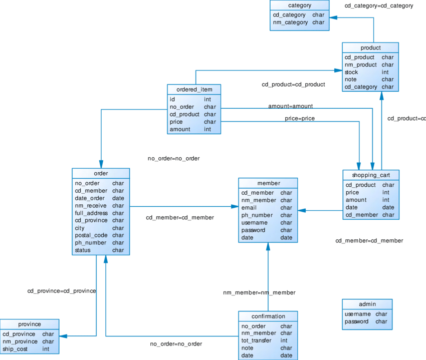

# Project Title

**Bold Project Title** project description.

---

## Table of Contents
1. [Project Description](#project-description)
2. [Software Dependencies](#software-dependencies)
3. [Database Setup](#database-setup)
4. [Backend Setup](#backend-setup)
5. [Frontend Setup](#frontend-setup)
6. [UI Overview](#ui-overview)
7. [Database ERD](#database-erd)
8. [Acknowledgement](#license)

---

## Project Description

Description lorem ipsum etc:
- **Subpoint**: Subpoint description.
- **Subpoint**: Subpoint description.
- **Subpoint**: Subpoint description.

---

## Software Dependencies

### Integrated Development Environment (IDE)
- **Core Developer IDE**: IntelliJ IDEA
- **Other Supported Editors**: Visual Studio Code (VS Code)
- **Additionally Supported**: Apache NetBeans, Eclipse, or any other suitable IDE for Java Spring Boot projects.

### Programming Language/Runtime Environment
- **Programming Language**: Java
- **Runtime Environment**: Java Development Kit (JDK) 17

### Database Connectivity
- **Driver**: Oracle JDBC (`ojdbc8`)
- **Framework**: Spring Data JPA (Java Persistence API) (via `spring-boot-starter-data-jpa`)
- **ORM Tool**: Hibernate (`hibernate-core`, version 6.5.3.Final)

### Application Server
- The project runs on **Spring Boot's embedded application server**, specifically the **embedded Apache Tomcat** (default in Spring Boot).

---

## Database Setup

Before setting up the database, ensure you have:
- A valid Oracle database instance.
- A user account with permissions to create tables and modify schema.

To execute the SQL scripts:
1. Go to the directory `dir`.
2. Open the files `schema.sql` and `migration.sql`.
3. Execute the scripts in Oracle SQL, in the following order:
   ```sql
   @schema.sql
   @migration.sql
    ```
---

## Backend Setup

1. To build and run the backend application:

- Make a clean installation using Maven:

mvn clean install
```bash
./mvnw clean install   # For Unix/Linux
.\mvnw clean install   # For Windows
```
2. Start the Spring Boot application:

mvn spring-boot:run
```bash
./mvnw spring-boot:run   # For Unix/Linux
.\mvnw spring-boot:run   # For Windows
```
The application will be accessible at http://localhost:8081.

---

## Frontend Setup

Ensure Node.js (version 16.x or above) is installed.

1. Navigate to the frontend directory:
```bash
cd assets/static
```
2. Install dependencies and build the project:
```bash
npm install
npm run build   # For production
```
3. To develop with hot reload:
```bash
npm run dev
```
Access the frontend at http://localhost:5173.


### UI Overview


### Database ERD



---

## Team Projects

### TEAM PROJECT 
- **Person Name**
- **Person Name**
- **Person Name**
- **Person Name**

---

## Acknowledgments

We would like to express our sincere gratitude to lorem ipsum etc ..
